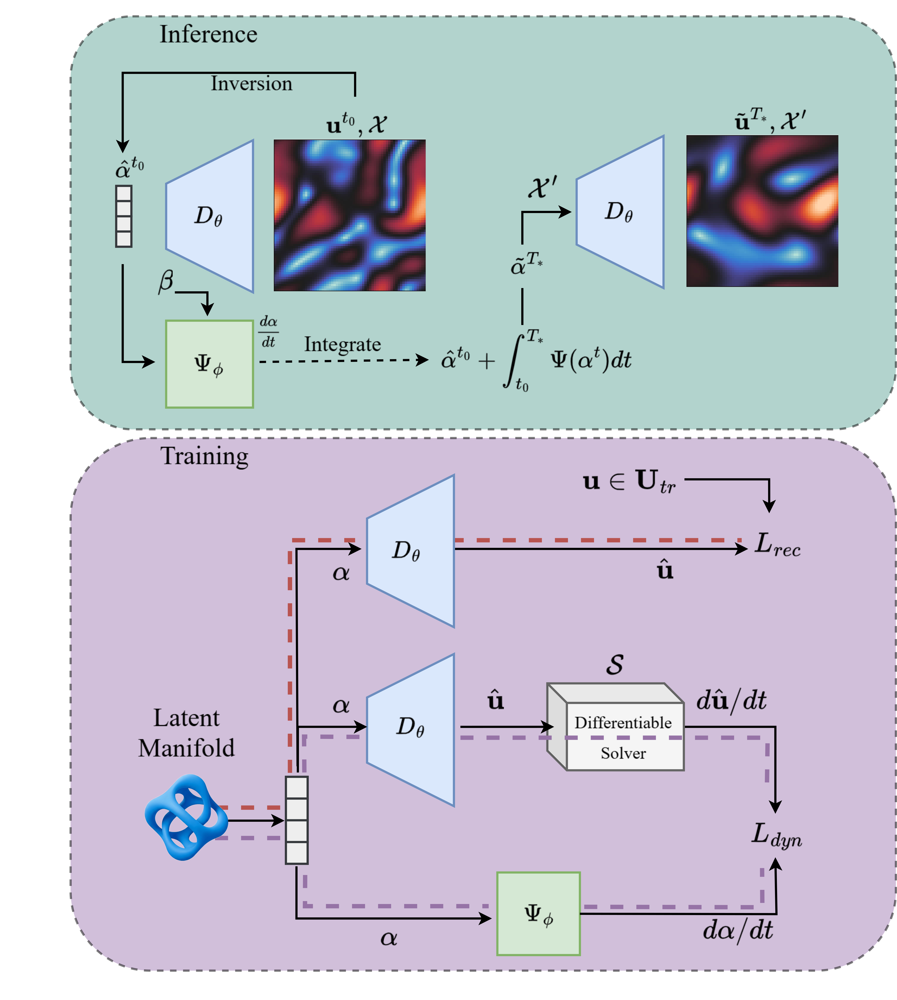

# Physics-informed Reduced Order Modeling of Time-dependent PDEs via Differentiable Solvers

[](https://neurips.cc/virtual/2025/poster/117995) [](https://phi-rom.github.io) [](LICENSE) 

**🚧 This repository is currently being updated. Please check back soon for more information. 🚧**

This repository contains the official JAX implementation for the paper **"Physics-informed Reduced Order Modeling of Time-dependent PDEs via Differentiable Solvers"**, accepted at NeurIPS 2025.

$\Phi$-ROM is a novel framework for creating **Physics-informed Reduced-Order Models** for time-dependent and parameterized Partial Differential Equations (PDEs). It incorporates **differentiable PDE solvers** directly into the training loop, ensuring the learned latent dynamics align closely with the discretized governing physics. This approach enhances generalization to unseen parameters, improves long-term forecasting, and works effectively even with sparse or irregular data.



---
## Key Features ✨

* **Physics-Informed Training**: Leverages differentiable PDE solvers (like JAX-CFD, XLB, Exponax) during training to enforce physical consistency in the latent space.
* **Enhanced Generalization**: Outperforms purely data-driven ROMs and other physics-informed strategies in generalizing to new dynamics from unseen parameters and initial conditions.
* **Improved Forecasting**: Enables accurate long-term forecasting beyond the training time horizon.
* **Mesh-Free & Continuous**: Utilizes Implicit Neural Representations (INRs) and Neural ODEs for a continuous representation in both space and time, allowing flexibility with grids.
* **Sparse Data Handling**: Capable of training and recovering full solution fields even from sparse and irregular observations.
* **Data Efficiency**: Achieves better performance with less training data compared to data-driven methods.
* **Extensible Framework**: Built with JAX, Equinox, Diffrax, and Optax, making it readily adaptable to other PDE systems and differentiable solvers in JAX.

---
## Repository Structure 📂

```

├── PHIROM/          
│   ├── modules/      \# Core model components (Decoders, Dynamics Networks)
│   ├── pde/          \# PDE definitions, data loaders, and solver interfaces
│   ├── training/     \# Trainer classes (PhiROM, DINo, CROM), callbacks, evaluation metrics
│   └── utils/        \# Utility functions (experiment setup, serialization)
├── data/
│   ├── scripts/      \# Scripts to generate datasets (Burgers, Diffusion, KdV, LBM, N-S)
│   └── *.h5          \# Placeholder for dataset files
├── experiments/      \# Bash scripts for running the experiments from the paper
├── script\_*.py       \# Main executable scripts for training specific models/datasets from the paper
├── requirements.txt  \# Python package dependencies
└── README.md         \# This file

````

---

## Installation 🔧

1.  **Clone the repository:**
    ````bash
    git clone https://github.com/phi-rom/PhiROM.git
    cd PhiROM
    ````
    
2.  **Create a virtual environment (recommended):**
    ````bash
    python -m venv phirom_env
    source phirom_env/bin/activate 
    ````
3.  **Install dependencies:**
    Phi-ROM requires JAX with GPU support. The requirements specify JAX with CUDA 12 support.
    ````bash
    pip install -r requirements.txt
    ````

    3.1 **Install Torch**
    You need to separately install the CPU version of [PyTorch](https://pytorch.org/) (used for data loading):
    ````bash
    pip install torch --index-url https://download.pytorch.org/whl/cpu
    ````

    3.2 **Install XLB**
    To run the Lattice Boltzmann experiments, install the latest [XLB](https://github.com/Autodesk/XLB) library:
    ````bash
    pip install git+https://github.com/Autodesk/XLB.git
    ````
---

## Usage 🚀
To reproduce the experiments from the paper, follow these steps:
### 1. Data Generation

Scripts for generating the datasets used in the paper are provided in the `data/scripts/` directory. For example, to generate the Navier-Stokes turbulence dataset:
````bash
python data/scripts/turbulence.py
````
    
Generated `.h5` files should be placed in the `data/` directory.

### 2\. Training Models

Training scripts for various configurations (Φ-ROM, DINo, PINN-ROM, CROM) and datasets (Burgers, Diffusion, KdV, LBM, N-S) are located in the `experiments/` directory.

You can run a specific training experiment using its corresponding shell script. For example, to train Φ-ROM on the Navier-Stokes turbulence dataset:

````bash
bash experiments/train_turbulence_PHIROM.sh
````

Alternatively, you can run the main Python scripts directly, passing hyperparameters as command-line arguments. For example:

````bash
python script_turbulence.py --latent_dim=100 --width=80 --node_width=512 --epochs=24000 --dataset='ns_turbulence_new_ins=5' --loss_lambda=0.5 --gamma=0.1 --evolve_start=100 ...
````

Refer to the individual `script_*.py` files and the `experiments/*.sh` scripts for available arguments and configurations. Training checkpoints and results will be saved in the `NODE_experiments/` or `CROM_experiments/` directory, organized by dataset and hyperparameters.

### 3\. Evaluation and Inference

The `PHIROM/training/evaluation.py` and `PHIROM/modules/inference.py` modules contain functions for evaluating trained models and performing inference (forecasting). The training scripts utilize evaluation callbacks (`PHIROM/training/callbacks.py`) to monitor performance during training.

-----
## Extending $\Phi$-ROM to New PDEs and Solvers🛠️
To extend $\Phi$-ROM to a new time-dependent PDE with a differentiable numerical solver implemented in JAX, follow these steps:

1. **Implement the PDE Class**: Create a new dataset class in `PHIROM/pde/` that loads the PDE data, including methods for data loading and normalization.
2. **Integrate the Differentiable Solver**: Implement a solver interface that wraps the differentiable solver, ensuring it can be called within the training loop.
3. **Update Training Scripts**: Modify or create new training scripts to utilize the new PDE class and solver, specifying appropriate hyperparameters.

Below is a simplified version of our navier-stokes experiments using [JAX-CFD](https://github.com/google/jax-cfd). See the complete code [here](PHIROM/pde/navier_turbulence.py). See also our [irregular data code](PHIROM/pde/navier_turbulence_irregular.py) for when the data and solver grids are different.

**Implement the PDE Class**: The dataset must implement the `__len__` and `__getitem__` methods with the following structure to return individual snapshots along with necessary parameters for the solver.

```python
# navier_turbulence.py
class NavierStokesDataset(torch.utils.data.Dataset):

    ...

    def __len__(self):
        """
        Returns the total numerber of snapshots (i.e. number of trajectories * timesteps per trajectory)
        """
        return len(self.trajectories) * self.num_time_steps

    def __getitem__(self, idx)
        """
        Returns a single snapshot, along with grid, time, and solver parameters.
        """

        traj_idx = idx // self.num_time_steps
        time_idx = traj_idx * self.num_time_steps
        u = self.trajectories[traj_idx, time_idx]

        return {
          "data": u,  # velocity field at this snapshot
          "t": self.t[traj_idx, time_idx], # time value
          "idx": traj_idx, # trajectory index needed for training auto-decoder
          "time_idx": time_idx, # time index needed for training auto-decoder
          "coords": self.X, # spatial grid of the snapshot
          "dt": self.dt[traj_idx], # time step size used in solver (None if not needed for your solver)
          "dx": self.dx, # spatial grid spacing used in solver (None if not needed for your solver)
          "solver_args": [ # any additional solver parameters needed for your solver
              self.density[traj_idx],
              self.viscosity[traj_idx],
              self.inner_dt[traj_idx],
          ] 
        }
```
If the PDE is parameterized (e.g., varying viscosity), the dataset must also return the pair `"node_args": array` containing the parameters that are passed to the dynamics network. Additional methods are required to provide data normalization statistics (refer to the complete code).

**Integrate the Differentiable Solver**: Implement a solver interface that wraps the differentiable solver. This interface should define a `residual` method that takes the current state and parameters, and returns the next state. The `residual` function must have the following signature: `residual(field_1, dt, dx, *solver_args)`. Note that the first three arguments (`field_1`, `dt`, `dx`) must be present even if not used by your solver.
 Example using JAX-CFD:

```python
# navier_turbulence.py
def cfd_residual_builder(grid):
    # JAX-CFD solver, where grid is the solver grid required by JAX-CFD. Note that this grid may be different from the data grid.
    solver = partial(cfd.equations.semi_implicit_navier_stokes, grid=grid) 

    def residual(field_1, dt, dx, density, viscosity, inner_dt, *args):
        """
        Computes the residual of the Navier-Stokes equations using JAX-CFD. 
        Your solver wrapper must have the first three arguments even if they are not used.

        Args:
            field_1: Array of shape (C, Nx, Ny) representing the reconstructed field at the current time step.
            dt: time step size between two consecutive data snapshots (not used here since the solver uses a different time step).
            dx: Spatial grid spacing (not used here).
            density: Fluid density parameter for the solver. Optional argument depending on the PDE solver.
            viscosity: Fluid viscosity parameter for the solver. Optional argument depending on the PDE solver.
            inner_dt: Time step size used within the solver. Optional argument depending on the PDE solver.
        Returns:
            Array of shape (C, Nx, Ny) representing the time derivative of the field computed by the solver.
        """
        
        # The code below is specific to JAX-CFD and may differ for other solvers.
        v0, v1 = field_1
        v0, v1 = grid.stagger((v0, v1))
        v = (
            cfd.grids.GridVariable(
                array=v0, bc=cfd.boundaries.periodic_boundary_conditions(2)
            ),
            cfd.grids.GridVariable(
                array=v1, bc=cfd.boundaries.periodic_boundary_conditions(2)
            ),
        )
        v = solver(dt=inner_dt, density=density, viscosity=viscosity)(v)
        # The solver returns the field at the next time step; we compute the time derivative as (v_next - v_current) / inner_dt
        return (jnp.stack([v[0].data, v[1].data], axis=0) - field_1) / inner_dt

    return residual
```
The residual function above is used by $\Phi$-ROM during training. Note that this function will be [JIT'ed](https://docs.jax.dev/en/latest/jit-compilation.html) during training and should be compatible with JAX transformations.

Now you can use the new dataset and solver to train 𝚽-ROM (see the [training script](script_turbulence.py)).


## Citation 📝

If you find this work useful, please cite our NeurIPS 2025 paper:

````bibtex
@inproceedings{hosseini2025phirom,
  title={{Physics-informed Reduced Order Modeling of Time-dependent PDEs via Differentiable Solvers}},
  author={Hosseini Dashtbayaz, Nima and Salehipour, Hesam and Butscher, Adrian and Morris, Nigel},
  booktitle={Advances in Neural Information Processing Systems},
  year={2025},
  volume={39}
}
````
